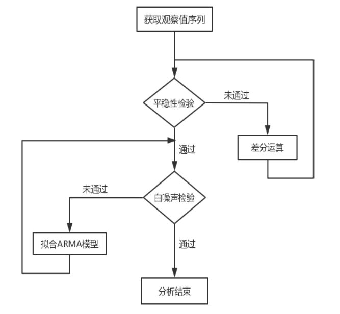

```{r setup, echo=F, purl=F}
knitr::opts_knit$set(root.dir = getwd())
knitr::opts_chunk$set(echo = TRUE, results = 'hide')
knitr::opts_chunk$set(warning = FALSE, message=FALSE)
knitr::opts_chunk$set(fig.align="center"
                      ## ,out.width="0.9\\textwidth" # latex
                      ,out.width="80%" # for both latex and html
                      ,fig.width=5, fig.height=3
                      )
```

```{r prepare, echo=F, purl=F}
rm(list=ls())
options(digits=4)
options(scipen=100)
graphics.off()
Sys.setlocale("LC_ALL", "Chinese")
library(reticulate)
```

<center>
**摘要**
</center>
 
2019年底新型冠状病毒的突然爆发与大面积传播蔓延，给全球各国人民都带来了严重的灾
难，造成了各国经济的严重损失。股票市场作为反映社会经济运行状况的“晴雨表”，本文以
2019年1月1日-2020年12月31日的沪深300指数的收盘指数为主要研究对象，计算收盘指数的
对数收益率，得到收益率的原始时间序列，以R软件为基本工具，分析收益率序列的波动情
况，最终拟合了ARIMA-GARCH模型。

首先绘制原序列的时序图，显示为非平稳时间序列，一阶差分后进行平稳性检验和纯随机性
检验，得到了平稳非白噪声序列。同时可以看出残差序列存在着异方差现象，所以需要从水
平方向信息提取和波动信息提取两个方面共同分析沪深300指数收益率序列。

在水平信息提取上，对一阶差分后得到平稳非白噪声序列进一步绘制自相关图和偏自相关
图，分析自相关系数和偏自相关系数是逐步衰减到零值，不是骤然下降的，符合拖尾特征，
可以拟合ARIMA模型，然后对残差序列进行白噪声检验，得到其为白噪声序列，最后根据AIC
准则得出ARIMA(1,1,2)为原始序列在水平方向上的最佳拟合模型。

在波动信息的提取上，分析残差序列在多数情况下在一个较小的范围内上下波动，但在某些
时间段残差序列出现大幅波动，呈现显著非平稳的状态，所以需要对残差序列拟合条件异方
差模型。首先对残差序列进行Portmanteau Q 检验和LM检验，结果显示残差序列符合方差非
齐性，进一步拟合GARCH(1,1)模型，模型通过显著性检验后绘制出条件异方差置信区间和方
差齐性置信区间的对比图，分析得出拟合GARCH(1,1)模型能更精确地描绘残差序列的波动趋
势。

综合建立的水平模型和波动模型，最终得到沪深300指数收益率序列的完整拟合模型为
ARIMA(1,1,2)-GARCH(1,1)，最后预测未来10期的沪深300指数收益率，预测值显示收益率的
值均大于0，说明股票市场的未来发展势头良好，沪深300指数呈现持续上升趋势。

 **关键词**：沪深300指数；收益率；ARIMA；条件异方差模型  


# 研究背景和意义

## 研究背景

随着我国金融证券市场的发展和不断完善，股票在我国经济发展中发挥着越来越重要的作
用。股票能够促进社会上闲散资金的自由合理流动，从而使得资金能够得到有效配置，所以
在一定程度上可以将股票看作是反映社会经济运行状况的“晴雨表”，不仅受到了政府和各类
企业的广泛重视，也得到了广大股民投资者的关注。

在股票市场中，收盘价不仅可以评判当前股票市场的行情，还可以为下一个交易日的开盘价
提供依据。股价的波动和走势是非常不确定的，但是股价的变化并不是完全是由随机因素引
起的，也会受到一些规律性因素的影响。比如当前国家甚至全球范围内的经济形势、政治文
化等因素，上市公司的经营和财务状况，一些重大突发事件等都会给股市带来较明显的影
响，进而可能导致股价的大幅波动，此外，投资者的心理状态以及对股票未来发展所持有的
态度会直接影响到不同的交易行为，进而对股价的波动也产生一定的影响，这些因素都会增
加股票市场的不稳定性。

2019年底新型冠状病毒首先在我国武汉大面积爆发，然后逐渐蔓延至全国各地，给全国人民的生命安全和健康造成了重大威胁，也给国家的经济、财政收入带来严重的影响。相比于 2003 年的SARS病毒的传播，这次的新冠病毒传播速度更快、感染范围更广、防控难度更大，之后新冠肺炎在欧美国家大面积爆发，美股在十天内发生了四次熔断，受到美股的影响，全球各大主要股市也急剧下跌，各国经济均出现明显衰退。

## 研究意义

随着新冠疫情在全球范围内大面积蔓延和传播，公众普遍对经济发展持悲观态度，投资者出
现恐慌性地抛售股票。面对日益增加的通货膨胀压力，以及金融市场的不稳定性和金融风险
不断增加，投资者对资金的避险需求也随之加大，这种重大突发事件的冲击给世界各国经济
经济、财政收入带来了严重的影响，也引起了股票市场的重大变化。

本文以我国沪深300指数为主要研究对象，探究在新冠肺炎疫情大规模爆发的背景下指数收
益率的波动情况，由此可以说明重大突发事件给我国金融市场带来的影响并预测其未来走
势。

一方面有利于国家、政府根据经济受挫情况及时调整并实施适当的政策刺激经济，恢复发展生产，减缓对经济市场状况的巨大冲击，也能实现对股票等金融市场的调控和监管，实现资金有序流动，保证我国经济的持续、健康、稳定发展。另一方面，金融市场关系着广大投资者和企业的切身利益，也有利于投资者对当前股票市场的波动情况有更加深入的了解，能够合理安排自身投资计划，保障自身利益。


# 模型的介绍 

## ARIMA(p,d,q)模型

ARIMA(p,d,q)模型称为求和自回归移动平均模型[@于雅凝2018基于]，其结构如下：

$$\left\{ {\begin{array}{l}{\phi(B)\triangledown^{d}x_t = \theta(B)\varepsilon _t}\\{{E(\varepsilon
_t)} =0,Var(\varepsilon
_t)=\sigma _\varepsilon^2,E(\varepsilon_t \varepsilon_s)=0,s\neq t }\\{{Ex_s\varepsilon_t} =0,\forall s<t
 }\end{array}} \right.$$ {#eq:1}

式中，$\triangledown^{d}=(1-B)^d$,$\phi(B)=1-\phi_1 B-...-\phi_p B^p$为平稳可逆
ARMA(p,q)模型的自回归系数多项式；$\theta(B)=1-\theta_1B-...-\theta_q B^q$为平稳
可逆ARMA(p,q)模型的移动平滑系数多项式。

d阶差分后序列可以表示为：
$$\triangledown^{d}x_t=\sum_{i=0}^d(-1)^iC_d^ix_{t-i}$$ {#eq:2}
式中，$C_d^i=\frac{d!}{i!(d-i)!}$为差分后序列。

ARIMA(p,q)模型的结构可以简记为：
$$\triangledown^{d}x_t=\frac{\theta(B)}{\phi(B)}\varepsilon_t$$ {#eq:3}
式中，$\left\{ \varepsilon_t \right\}$为零均值白噪声序列。

由式[@eq:1]可以看出，ARIMA 模型的实质是对原始序列进行差分后再拟合ARMA模型，通过
这一组合可以说明，对于一个给定的非平稳时间序列，首先对其进行一定阶数的差分运算，
如果能够变成平稳序列，那么就可以对其进一步拟合 ARMA 模型。

另外对于ARIMA(p,d,q)模型的特殊形式也可以得到结论：当d=0时，说明原序列不进行差分
运算，即为ARMA(p,q)模型；当p=0时，即为ARIMA(0,d,q)模型，实质就是IMA(d,q)模型；当
q=0时，说明可以将ARIMA(p,d,0)模型表示为 ARI(p,d)模型的形式。

利用ARIMA模型对序列进行建模的基本步骤为：

```{r kuangjia,eval=T,echo=F, fig.align='center',fig.pos="H",fig.cap="ARIMA建模基本步骤",dev="png",results='markup'} 

 

```

## ARCH(p,q)模型

ARCH 模型称为自回归条件异方差模型，ARCH 模型的完整结构如下：

$$\left\{ {\begin{array}{l}{x_t=f(t,x_{t-1},x_{t-2},...)+\varepsilon_t}\\{{\varepsilon
_t} =\sqrt {h_te_t} }\\{{h_t=\omega+\sum_{j=1}^q \lambda_j \varepsilon _{t-j}^2
}}\end{array}} \right.$$ {#eq:4}

式中，$f(t,x_{t-1},x_{t-2},...)$为$\left\{ x_t \right\}$的确定性信息拟合模型，
$e_t\sim N(0,\sigma^2)$。

ARCH模型构造的思想是，利用历史信息，得到条件方差信息，即：
$$Var(\varepsilon_t|\varepsilon_{t-1},\varepsilon_{t-2},...)=E(\varepsilon_t|\varepsilon_{t-1},\varepsilon_{t-2},...)=\omega+\sum_{j=1}^q
\lambda_j \varepsilon _{t-j}^2 $$ {#eq:5}

一般情况下，对于一个给定的时间序列，在不同的时刻，它所蕴含的历史信息各不相同，所以不同时刻对应的条件方差也不相同。相比于无条件方差，ARCH模型更能及时反映出序列即期波动的特征，刻画出随着时间的变动序列的条件方差的变化。


## GARCH(p,q)模型

在实际应用中，ARCH模型也存在一定的局限性，比如只有当一个时间序列的残差序列的异方
差函数符合短期自相关时，拟合ARCH 模型才是比较恰当的。但实际应用中并非都是这种情
况，也存在较多的残差序列的异方差函数具有长期自相关性的现象，此时如果还继续拟合
ARCH模型就会出现问题，会使得模型的移动平均阶数大大增加，使得参数的估计变得困难，
进一步还会影响模型的拟合效果，所以此时拟合ARCH模型不是最佳的选择，需进一步考虑构
建新的模型。

这也是拟合时间序列模型的一大问题所在，针对于此，学者Bollerslov 在1985年提出了广义自回归条件异方差模型，可记为GARCH(p,q)模型[@刘浩宇2018基于]，其具有如下结构：
$$\left\{ {\begin{array}{l}{x_t=f(t,x_{t-1},x_{t-2},...)+\varepsilon_t}\\{{\varepsilon
_t} =\sqrt {h_te_t} }\\{{h_t=\omega+\sum_{i=1}^p \eta_i h _{t-i} +\sum_{j=1}^q
\lambda_j \varepsilon _{t-j}^2 }}\end{array}} \right.$$ {#eq:6}

式中，$f(t,x_{t-1},x_{t-2},...)$为$\left\{ x_t \right\}$的确定性信息拟合模型；
$e_t\sim N(0,\sigma^2)$。

通过对式[@eq:6]作进一步分析可以看出，GARCH模型的实质是在 ARCH模型的基础上，将异方差函数具有p阶自相关性的内容加入到模型中去，可以看作是ARCH模型的延申。

```{r arma,eval=T,echo=F}
library(zoo)
library(lmtest)
library(tseries)
library(forecast)
library(FinTS)
library(fBasics)
library(fUnitRoots)
```

# 模型的建立与应用

## 数据预处理

本文的研究对象是沪深300指数，选取了2019 年 1 月 1日— 2020 年 12 月31日沪深 300
指数的收盘指数的日度数据，共得到486组数据，数据来源于CSMAR网站
（https://cn.gtadata.com/）。

根据搜集得到的样本数据，首先计算出沪深 300 指数的对数收益率，读入数据后绘制出时
序图，可以看出时间序列数据存在一定的线性趋势，于是对原始收益率数据进行一阶差分处
理，并绘制出差分后序列的时序图如下：

```{r fig2,eval=T,echo=F,cache=T,fig.align='center',fig.pos="H",fig.cap="一阶差分序列时序图",dev=c("png","cairo_pdf"),results='markup',fig.height=4,out.width="90%"}
w<-read.table("C:/github_repos/ts_paper_xxy/hs.csv",sep=",",header = T)
x<-ts(w$returns,start=c(2019,1,1),frequency = 245)
plot(diff(x))
```

由图\@ref(fig:fig2)可以看出：原始收益率序列经过一阶差分后，数值在均值附近持续平稳波动，说明差
分后的序列为平稳序列，为进一步验证，对其分别进行平稳性检验和延迟6阶和12阶白噪声
检验，平稳性检验采用R中ADF检验，白噪声检验利用R语言中Box.test函数，采用LB检验统
计量，得到如下结果：

ADF检验：

```{r eval=T,echo=F,cache=T,results='markup'}
w<-read.table("C:/github_repos/ts_paper_xxy/hs.csv",sep=",",header = T)
x<-ts(w$returns,start=c(2019,1,1),frequency = 245)
x.dif=diff(x)
for (i in 1:3) print(adfTest(x.dif,lag=i))
```

纯随机性检验：

```{r eval=T,echo=F,cache=T,results='markup'}
w<-read.table("C:/github_repos/ts_paper_xxy/hs.csv",sep=",",header = T)
x<-ts(w$returns,start=c(2019,1,1),frequency = 245)
x.dif=diff(x)
for (i in 1:2) print(Box.test(diff(x),lag=6*i))
```

在利用R进行平稳性检验和纯随机性检验中，检验结果直接给出了各检验统计量对应的P值，由上述结果可以看出：P值远小于0.05，做出拒绝原假设的决定，说明一阶差分处理后的序列是平稳非白噪声序列。


## 水平信息提取

### 模型识别

根据上述对序列的平稳性检验和纯随机性检验结果显示，在序列的水平方向上，原始序列为非平稳序列，首先经过一阶差分处理，变成可以建模的平稳非白噪声序列，进一步绘制差分序列的自相关图和偏自相关图如下：

```{r fig3,eval=T,echo=F,cache=T,fig.align='center',fig.pos="H",fig.cap="差分序列自相关图和偏自相关图",dev=c("png","cairo_pdf"),results='markup',fig.height=6,out.width="90%"}
w<-read.table("C:/github_repos/ts_paper_xxy/hs.csv",sep=",",header = T)
x<-ts(w$returns,start=c(2019,1,1),frequency = 245)
x.dif=diff(x)
par(mfrow = c(2,1))
a=acf(x.dif)$acf
b=pacf(x.dif)$acf
```

图\@ref(fig:fig3)展示了一阶差分序列的自相关系数和偏自相关系数衰减到零的过程，上图显示，该序列的自相关系数和偏自相关系数衰减到零都不是骤然下降的，而是一个逐渐衰减
的过程,自相关系数从延迟2阶开始，以上下波动的趋势逐步衰减至0，而偏自相关系数则从
延迟1阶开始以负指数的形式逐步衰减至零值附近，衰减的速度是一个比较缓慢的过程，因
此可以说自相关和偏自相关系数均呈现出拖尾的特征。

在对沪深300指数收益率序列的水平信息提取上，综合考察自相关图和偏自相关图的属性，
自相关系数和偏自相关系数的变化均没有出现明显的急速收敛下降的趋势，可以初步确定原
始收益率序列在水平信息提取上拟合的模型为 ARIMA(1,1,2)模型。

### 模型检验

上述模型的拟合结果给出了模型的各参数值以及模型的估计误差以及AIC值，此外还需要对
该拟合模型的残差序列进行白噪声检验，对残差序列进行延迟1-6阶的白噪声检验，得到的
检验结果如下：

```{r eval=T,echo=F,cache=T,results='markup'}
w<-read.table("C:/github_repos/ts_paper_xxy/hs.csv",sep=",",header = T)
x<-ts(w$returns,start=c(2019,1,1),frequency = 245)
x.fit<-arima(x,order = c(1,1,2)) #拟合ARIMA(1,1,2)模型
#对残差序列白噪声检验
for (i in 1:6) print(Box.test(x.fit$residual,type = "Ljung-Box",lag=i))
##接受原假设 残差序列为白噪声序列
```


由上述检验结果可以看出，拟合模型的残差序列延迟1-6阶的检验统计量的P值均大于显著性水平0.05，即$P>\alpha$，接受原假设，残差序列的白噪声检验通过，说明残差序列为白噪声序列，该模型显著成立．这说明在水平方向上，ARIMA(1,1,2)模型对该序列的拟合是成功的。


### 模型优化

一般情况下，如果一个拟合模型通过检验，说明该拟合模型是有效的，但能够有效拟合观察值序列波动的模型并不是唯一的，通过观察一阶差分后序列的自相关图和偏自相关图，分别拟合ARIMA(0,1,2)、ARIMA(0,1,3)、ARIMA(1,1,2)等模型，并计算各模型的AIC值如下表：

```{r tab1, eval=T,results='markup',echo=F}
return.desc=read.csv('./results/tab1.csv')
library("kableExtra")
knitr::kable(return.desc, row.names =F, align = c("c", "c"),caption="拟合模型和AIC值",digits = 2,
             longtable = TRUE, booktabs = TRUE, escape = F, linesep = "") 
```

AIC准则是衡量统计模型拟合优良性的一种标准，一般情况下，对于一个给定的时间序列，
可以拟合出来的模型不止一个，可能有多个，一般认为使得AIC值达到最小的模型为最优模
型。AIC的结构为拟合精度和参数未知个数的加权函数，具体表达式如下：

AlC=2ln(模型中极型中极大似然)+2(模型中未知参数个数)

由拟合模型的AIC值汇总表可知，在收益率序列可能的拟合模型中，ARIMA(1,1,2)模型对应
的AIC值最小，为原始收益率序列在水平方向上的最佳拟合模型。


可以得出：在水平方向上，沪深300指数收益率序列的拟合模型为：
$$x_t-0.0547x_{t-1}-0.9453x_{t-2}=\varepsilon
_t-0.0017\varepsilon_{t-1}-0.9982\varepsilon_{t-2},\varepsilon_{t}\sim N(0,1.767)$$

## 波动信息提取
在宏观经济领域和金融领域，常常出现一种情况，有学者将其称为集群效应。它是指对于金
融领域的大部分非平稳时间序列，在进行差分运算处理并拟合相应模型之后，观察其残差序
列时，可以发现残差序列在多数情况下在一个较小的范围内上下波动，但是仍存在特殊的情
况，即在某些时间段残差序列出现大幅波动，呈现显著非平稳的状态。集群效应可以说明，
在给定的时间序列的全部时间段内，序列的方差大体呈现出齐性的特征，但是仍存在一段或
几段时期内的方差显著增大，明显高于期望方差。

本文的研究对象为股票市场沪深300指数的收益率波动情况，在对原序列水平方向上的信息
进行提取后，也应该进一步分析其残差序列的波动情况。

首先绘制残差序列的时序图如下：
```{r fig4,eval=T,echo=F,cache=T,fig.align='center',fig.pos="H",fig.cap="残差序列时序图",dev=c("png","cairo_pdf"),results='markup',fig.height=4,out.width="90%"}
w<-read.table("C:/github_repos/ts_paper_xxy/hs.csv",sep=",",header = T)
x<-ts(w$returns,start=c(2019,1,1),frequency = 245)
x.fit<-arima(x,order = c(1,1,2)) 
##波动信息提取
plot(x.fit$residual)
```


时序图显示的残差序列没有显著的非平稳特征。序列始终在零值附近上下波动，且波动主要
集中在-2~2这个范围之内。但也可以较明显地观察出，在一些特殊时段，比如2019年2月和3
月前后、2020年1月前后、2020年5月前后，残差序列的波动不再平稳，而是出现大幅上升和
下降，这一现象符合集群效应的特征。

进一步绘制残差平方图如下：

```{r fig5,eval=T,echo=F,cache=T,fig.align='center',fig.pos="H",fig.cap="残差平方图",dev=c("png","cairo_pdf"),results='markup',fig.height=4,out.width="90%"}
w<-read.table("C:/github_repos/ts_paper_xxy/hs.csv",sep=",",header = T)
x<-ts(w$returns,start=c(2019,1,1),frequency = 245)
x.fit<-arima(x,order = c(1,1,2)) 
plot((x.fit$residual)^2)
```


上图更能明显地观察出残差序列存在显著的方差非齐性的特征。此时，沪深300指数的序列拟合模型的残差序列存在异方差性，且不知道异方差函数的具体形式，因此需要对残差序列进一步拟合条件异方差模型。

### ARCH检验

由上文可知，在对原始沪深300指数收益率序列波动信息的提取上，需要拟合 ARCH 模型。

在对残差序列拟合条件异方差模型时，首先要进行 ARCH 检验。

（1） Portmanteau Q 检验

Portmanteau Q 统计方法用于检验残差平方序列的自相关性。对沪深300指数收益率序列的残差平方序列进行Portmanteau Q 检验，直接利用R中函数进行检验，得到如下结果：

```{r eval=T,echo=F,cache=T,results='markup'}
w<-read.table("C:/github_repos/ts_paper_xxy/hs.csv",sep=",",header = T)
x<-ts(w$returns,start=c(2019,1,1),frequency = 245)
x.fit<-arima(x,order = c(1,1,2)) #拟合ARIMA(1,1,2)模型
for(i in 1:2) print(Box.test((x.fit$residual)^2,lag=i))
```

（2）拉格朗日乘子检验

拉格朗日乘子检验也是一种重要的 ARCH检验方法，一般可以简记为 LM 检验。对残差序列进行拉格朗日乘子检验，直接利用FinTS包中的ArchTest函数即可进行检验，得到如下结果：

```{r eval=T,echo=F,cache=T,results='markup'}
w<-read.table("C:/github_repos/ts_paper_xxy/hs.csv",sep=",",header = T)
x<-ts(w$returns,start=c(2019,1,1),frequency = 245)
x.fit<-arima(x,order = c(1,1,2)) #拟合ARIMA(1,1,2)模型
for(i in 1:2) print(ArchTest(x.fit$residual,lag=i))
```

由以上检验的结果可以看出：残差平方序列延迟各阶的检验统计量的P值均远小于显著性水平α，做出拒绝原假设的结论，即残差平方序列并非纯随机序列，而是具有方差非齐的特征，存在显著的自相关性，可以用GARCH 模型提取残差平方序列中蕴涵的相关信息，可以拟合GARCH(1,1)模型。

### GARCH模型拟合

对残差序列拟合GARCH(1,1)模型，得到结果如下：

```{r eval=T,echo=F,cache=T,results='markup'}
w<-read.table("C:/github_repos/ts_paper_xxy/hs.csv",sep=",",header = T)
x<-ts(w$returns,start=c(2019,1,1),frequency = 245)
x.fit<-arima(x,order = c(1,1,2)) #拟合ARIMA(1,1,2)模型
r.fit<-garch(x.fit$residual,order=c(1,1))
#summary(r.fit)
```

由检验结果可以看出，t检验统计量均落在拒绝域内，统计量的P值均远小于显著性水
平，拟合模型的参数检验结果均显著，所以最后得到的拟合模型是 GARCH(1,1)模型。

绘制条件异方差拟合的95%的波动置信区间：

```{r fig6,eval=T,echo=F,cache=T,fig.align='center',fig.pos="H",fig.cap="GARCH(1,1)模型拟合的波动置信区间",dev=c("png","cairo_pdf"),results='markup',fig.height=4,out.width="90%"}
w<-read.table("C:/github_repos/ts_paper_xxy/hs.csv",sep=",",header = T)
x<-ts(w$returns,start=c(2019,1,1),frequency = 245)
x.fit<-arima(x,order = c(1,1,2)) 
r.pred<-predict(r.fit)
plot(r.pred)
```


条件异方差置信区间和方差齐性置信区间比较：

```{r fig7,eval=T,echo=F,cache=T,fig.align='center',fig.pos="H",fig.cap="条件异方差置信区间和方差齐性置信区间对比图",dev=c("png","cairo_pdf"),results='markup',fig.height=4,out.width="90%"}
w<-read.table("C:/github_repos/ts_paper_xxy/hs.csv",sep=",",header = T)
x<-ts(w$returns,start=c(2019,1,1),frequency = 245)
x.fit<-arima(x,order = c(1,1,2)) 
plot(x.fit$residual)
lines(r.pred[,1],col=2)
lines(r.pred[,2],col=2)
abline(h=1.96*sd(x.fit$residual),col=4,lty=2)
abline(h=-1.96*sd(x.fit$residual),col=4,lty=2)
```


图\@ref(fig:fig7)同时给出了条件异方差模型拟合的 95% 置信区间（两条波动实线）和无条件方差两条平
行线给出的 95% 的置信区间（两条平行虚线），中间的波动曲线是沪深300指数收益率序列
拟合模型的残差序列经过一阶差分后的序列。通过对上图进行综合对比分析得出，对残差序
列拟合的GARCH(1,1)模型能更好地表现出残差序列的波动特征，既有较为平缓的波动，也有
方差较为显著的大幅波动，更加符合原序列的真实波动情况，凸显出沪深300指数收益率序
列的集群效应的特征。

综合水平模型和波动模型[@张东旭0基于]，可以得到沪深300指数收益率序列的完整拟合模型为ARIMA(1,1,2)-GARCH(1,1)，具体表达式如下：
$$\left\{ {\begin{array}{l}x_t-0.0547x_{t-1}-0.9453x_{t-2}=\varepsilon
_t-0.0017\varepsilon_{t-1}-0.9982\varepsilon_{t-2}+v_t,v_{t}\sim N(0,1.767)\\{{v
_t} =\sqrt {h_te_t} }\\{{h_t=0.01074h_{t-1}+0.10702v_{t-1}^2+1.552}}\end{array}}
\right.$$


### 收益率预测

根据在水平方向上对序列拟合的ARIMA(1,1,2)模型，可以对沪深300指数收益率序列向前预测10期，得到未来10日内收益率的波动趋势[@薛世奇2019沪深]，并绘制预测表和预测图如下：

```{r tab2, eval=T,results='markup',echo=F}
return.desc=read.csv('./results/tab2.csv')
library("kableExtra")
knitr::kable(return.desc, row.names =F, align = c("c", "c", "c", "c"),caption="沪深300指数收益率序列预测表",digits = 4,
             longtable = TRUE, booktabs = TRUE, escape = F, linesep = "") 
```


```{r fig8,eval=T,echo=F,cache=T,fig.align='center',fig.pos="H",fig.cap="沪深300指数收益率序列预测图",dev=c("png","cairo_pdf"),results='markup',fig.height=4,out.width="90%"}
w<-read.table("C:/github_repos/ts_paper_xxy/hs.csv",sep=",",header = T)
x<-ts(w$returns,start=c(2019,1,1),frequency = 245)
x.fit<-arima(x,order = c(1,1,2)) 
x.fore<-forecast(x.fit,h=10)
plot(x.fore)
```

# 结论

本文的研究对象是沪深300指数，选取了自2019年1月1日-2020年12月31日的沪深300指数的
收盘指数的最新共486期的日度数据，并取其对数收益率，分析其收益率序列的波动情况。

由绘制的原始序列时序图显示存在明显的趋势，为非平稳时间序列．经过一阶差分后消除其
线性趋势，但可以发现残差序列存在着异方差现象，所以需要从水平方向信息提取和波动信
息提取两个角度共同分析沪深300指数收益率序列。

在水平方向上，由于原始序列为非平稳序列，进行一阶差分后为平稳非白噪声序列，通过考
察差分后序列的自相关图和偏自相关图，得出自相关系数和偏自相关系数均拖尾，最终拟合
ARIMA(1,1,2)模型，此时模型的AIC值最小，且该拟合模型的残差白噪声检验显示该模型显
著成立。


在波动信息的提取上，可以观察出序列存在较明显的集群效应，所以需要对残差序列拟合条件异方差模型，首先进行Portmanteau Q 检验和LM检验，检验结果显示残差序列确实具有方差非齐的特性，进一步拟合GARCH(1,1)模型，再进行模型显著性检验并绘制条件异方差置信区间和方差齐性置信区间的对比图，得出拟合GARCH(1,1)模型能更精确地描绘残差序列的波动趋势，最后预测未来10期的沪深300指数收益率均大于0，说明未来发展势头良好，指数呈现持续上升趋势。


# 参考文献
[//]: # (\bibliography{Bibfile})

